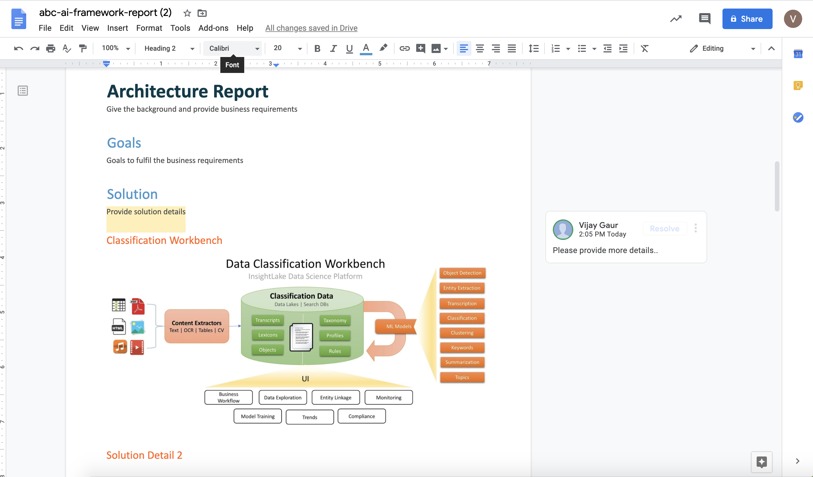

# Report-Maker

## Introduction

InsightLake Report Maker provides an intuitive UI that allows users to build a knowledge base and create quick PDF reports. It uses NLP models to provide suggestions and quick search. It also allows team collaboration. 

## Knowledge Base

Users can create knowledge bases as a reference material, which can be used in reports. A Knowledge base contains chapter groups. For example we can create a knowledge base of AWS Cloud and it can contain chapter groups of Storage, Big Data, Machine Learning, Security etc.

Chapter groups contain chapters about various topic like Security would contain IAM Permissions chapter.

## Chapters

Chapters are reference topics containing details, which could be easily included in a report.

## Reports

Users can create different types of reports for example Engagement report, Architecture report etc. These reports can contain Specific details or solutions and reference material from knowledge base. 

### Templates

Different templates can be created to provide a framework (important sections etc.) for reports. 

### Report Creation

Using intuitive editor reports can be created and previewed and reference chapters could be added.

### Collaboration

Users can collaborate on the report, provide and incorporate feedback changes.

### Generation

Users can generate a report in PDF or Google form and can also download them. 

#### PDF

#### Google Doc

### Search

Users can search reports using metadata and contents.

### Audit/History

Reports and knowledge base changes, approval history are captured.

### GIT Integration

Solution can be integrated with GIT easily.

To learn more, check out [http://www.insightlake.com/report-maker.html](http://www.insightlake.com/report-maker.html)

Installation
------
* Download or clone the repository. 
* Run bin/insightlake command.
* Open browser with URL as http://localhost:8080/
* Change configuration in /conf folder to set different ports
* By default H2 database is used, you can change the database details in jdbc.properties file

Installation using docker 
------
* Download or clone the repository. 
* Change configuration in lib h2.properties file
* Assign elastisearch configuration and basdir path inside container
* cd /docker
* Run `docker-compose -f docker-compose.yaml up --build`
* Open browser with URL as http://localhost:9494/insightlake

License
------
InsightLake Report Maker is closed source but distributed to be used freely. Please contact contact@insightlake.com for details.

Getting Help
----------

You can get help easily :
Community - Google Groups
Slack Channel
Twitter
Facebook
Email: contact@insightlake.com

