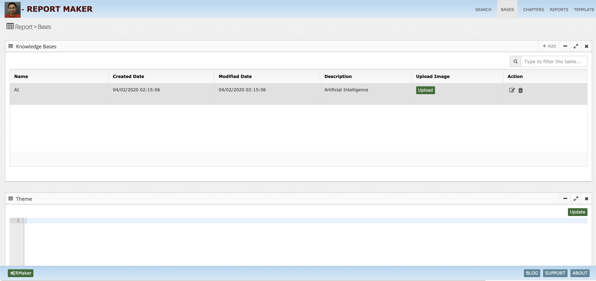
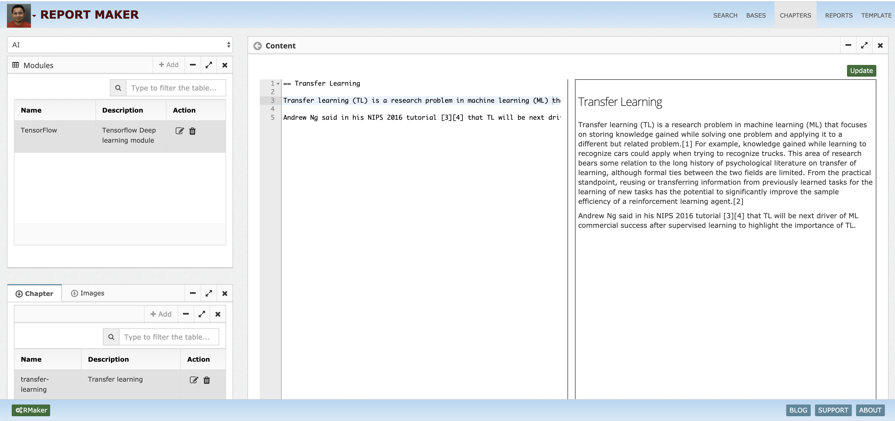
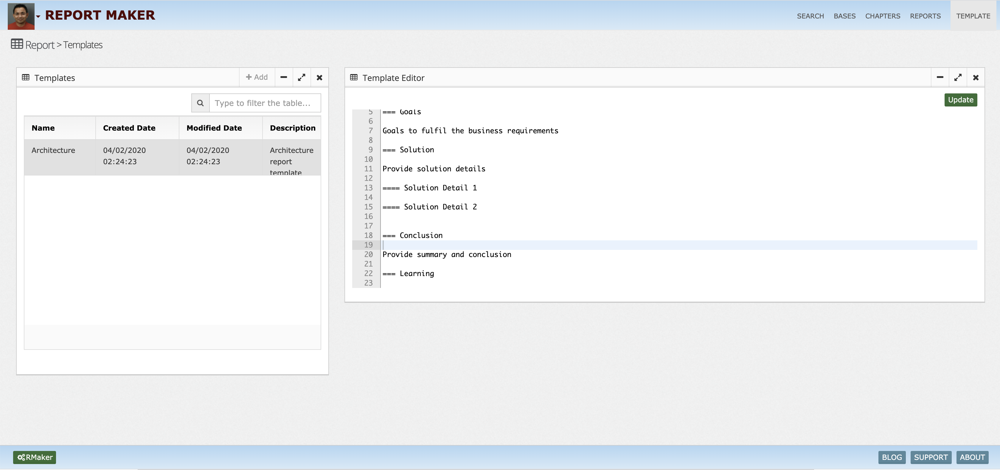
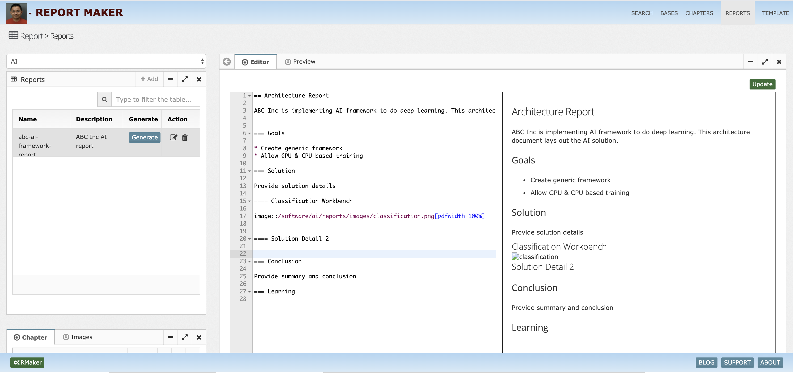
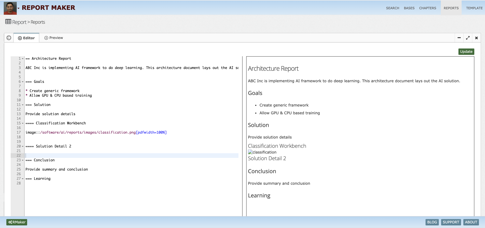
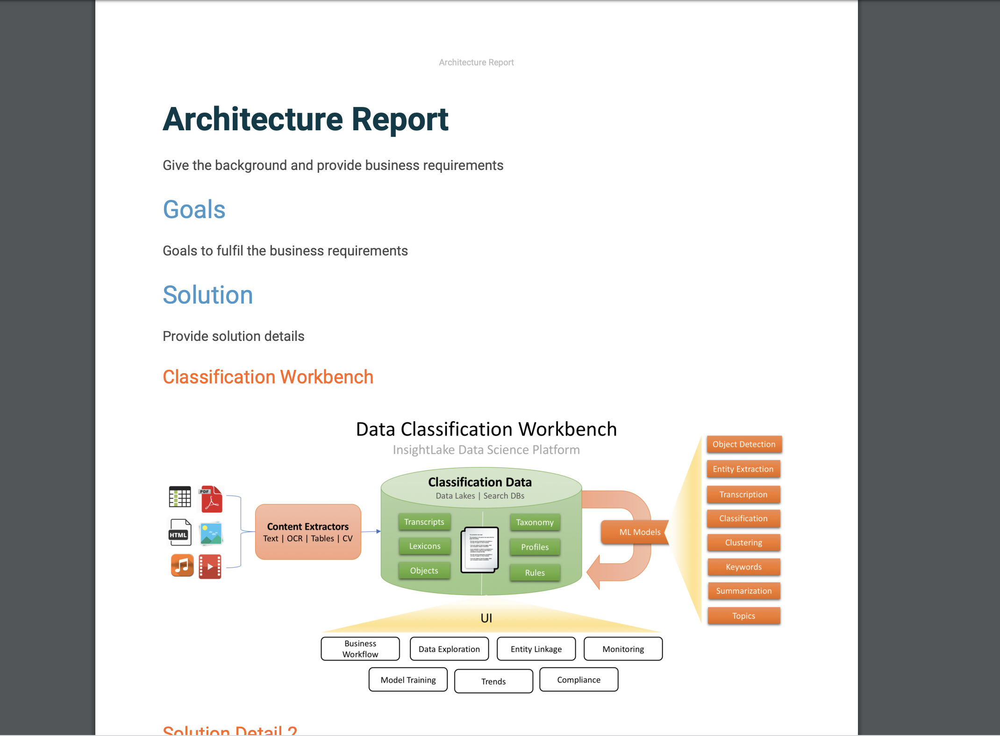

# Report-Maker
Report Maker

What is InsightLake Report Maker?
-----------

InsightLake Report Maker provides an intuitive UI and allows users to build knowledge base and create quick reports. It uses NLP models to provide suggestions and quick search. It also allows team collaboration. 

Pages:

Knowledge Base Chapters

Allow a user to create new chapter. User can write content, refer to images etc.

Reports

Allow a user to create new report using a predefined template, user fills template data. Suggestions are prompted and text snippets are added.

Collaboration
We need to allow other users to review document and provide comments, approve document.

Generation
Click on the generate report button, which will create a pdf report. 

Search
Allows users to search reports, chapters etc

Audit/History
We can update and create new drafts and versions

UI Pages:
After login user sees the following:
Main Name: Report Maker, Short button name RMaker

Pages: 
1. Search - Allow users to search reports, knowledge bases
On the page show search box and table below for results.

2. Bases - Knowledge bases
Name, Category, Created By, Created, Modified By, Modified, Status, Description

Create top pane to show knowledge base table and below another tabbed tables..
First tab showing chapters, Second tab images
In chapters tab allow user to create a new chapter on a popup.
Chapter table shows.. name, description, view button, created by, created, modified by modified and description

Images tab - allow users to upload images with name, created by, created, modified by modified and description

3. Reports 
Create table with fields like
name, template, status, view, Created By, Created, Modified By, Modified, Status, Description, generate, approve

show two tables on the page top shows reports and bottom shows history of changes and another tab feedback.

4. Templates
Create a template and properties to provide structure of the report.
Two tables on the page:
Top table templates with name, Created By, Created, Modified By, Modified, Status, Description
Bottom tabs
1. Sections - Create section with Header, Sample Text
2. Properties - Create global properties, which gets filled in the report

To learn more, check out [http://insightlake.com/reportmaker.html](http://insightlake.com/reportmaker.html)

Installation
------
* Download or clone the repository. 
* Run bin/insightlake command.
* Open browser with URL as http://localhost:8080/
* Change configuration in /conf folder to set different ports
* By default H2 database is used, you can change the database details in jdbc.properties file

License
------
InsightLake Report Maker is closed source but distributed to be used freely. Please contact contact@insightlake.com for details.

Getting Help
----------

You can get help easily :
Community - Google Groups
Slack Channel
Twitter
Facebook
Email: contact@insightlake.com

